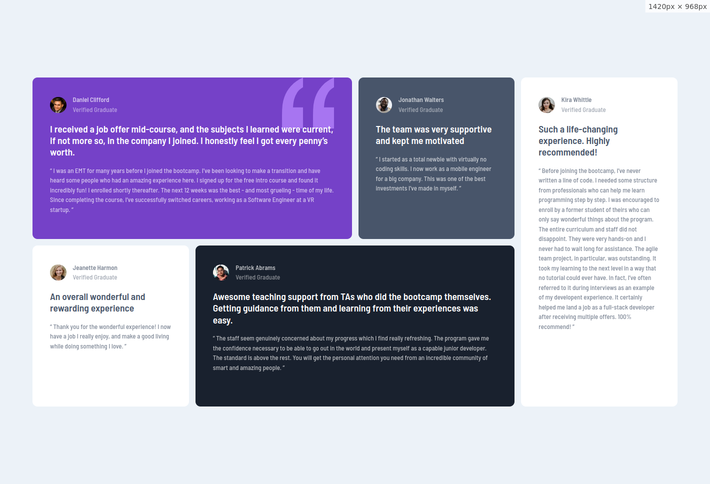

# Frontend Mentor - Testimonials grid section solution

This is a solution to the [Testimonials grid section challenge on Frontend Mentor](https://www.frontendmentor.io/challenges/testimonials-grid-section-Nnw6J7Un7). Frontend Mentor challenges help you improve your coding skills by building realistic projects. 

### The challenge

Users should be able to:

- View the optimal layout for the site depending on their device's screen size

### Screenshot

### Links

- Solution URL: [github](https://github.com/mostafa-hsh/testimonials-grid-section)
- Live Site URL: [github pages](https://mostafa-hsh.github.io/testimonials-grid-section/)

### Built with

- Semantic HTML5 markup
- CSS Grid
- Mobile-first workflow

### Author

- Frontend Mentor - [@mostafa-hsh](https://www.frontendmentor.io/profile/mostafa-hsh)

thanks FRONTEND-MENTOR